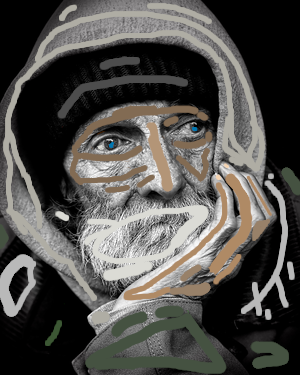
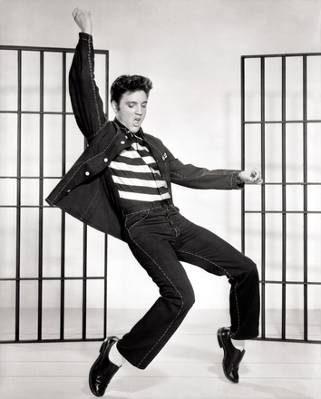
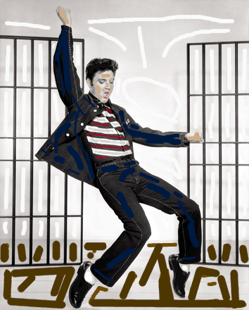
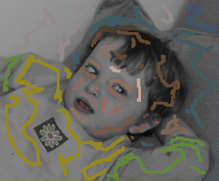
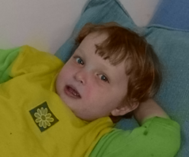
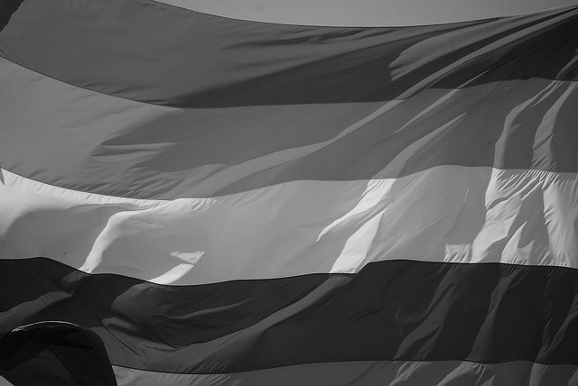
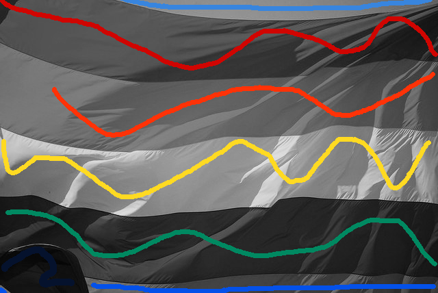
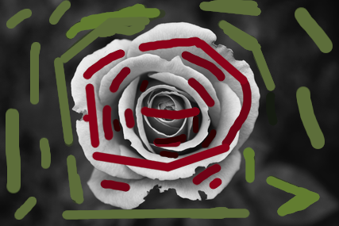

# Colorization using Optimization

This repository contains a C++ implementation of the algorithm described in 
A. Levin D. Lischinski and Y. Weiss Colorization using Optimization. ACM Transactions on Graphics, Aug 2004
for coloring grayscale images.

The sparse least squares optimization problem is solved using [Eigen3](https://eigen.tuxfamily.org/)'s
[biconjugate gradient stabilized solver](https://eigen.tuxfamily.org/dox/classEigen_1_1BiCGSTAB.html).

The coefficient matrix, `A`, has shape `N x N` where `N` is the number of pixels in the image,
but the sparse matrix format only requires us to store `O(NK)` entries, where `K` is the roughly the number of neighbors for each pixel (currently set to 8).

Due to the large size of this problem, this implementation can only color images of moderate sizes (~O(100) x O(100)), although if there is sufficient memory, the program will still run.

## Compile

### Requirements

1. [C++11/14/17](https://isocpp.org/)
1. [OpenCV](https://opencv.org/)
2. [Eigen3](https://eigen.tuxfamily.org/)
3. [CMake](https://cmake.org/) optionally for generating Makefile.

### Compiling with CMake

This project includes a `CMakeLists.txt` to help locate the required libraries and their header files and generate the Makefile. If the above requirements are met, the following will generate the binary `colorize`.

```bash
mkdir build
cd build
cmake ..
make
```

### Compiling without CMake

Edit the `Makefile` under the root directory so that the compiler can find the required libraries and header files. Then run `make` in the terminal to compile the project.

```bash
make
```

## Run

The compiled binary is located in the `bin/` directory.
It takes in a grayscale image, an image with line scribbles, and the path to output the colored image

```bash
./colorize ../data/man.bmp ../data/man_marked.bmp ../data/man_res.png
```

The program takes in two optional parameters, `gamma` and `threshold`.
`gamma` (default value 2.0) is a weighting factor for computing the similarity weights between pixels.

`threshold (default value 10)` is used as a threshold for extracting the color scribbles from the image. 
You want to set this to a larger value if the masked scribbles contain pixels from the original grayscale image so that those pixels get removed, otherwise parts of the image will appear gray. 

However, setting this parameter too large will typically cause more of the scribbles to be removed, so adjust this with care.


```bash
./colorize ../data/man.bmp ../data/man_marked.bmp ../data/man_res.png 2.0 10
```

## Sample results

Original                       | Scribbles                              | Result                          
:-------------:                | :-------------:                        | :-----:                         
      |       |      
   |    |   
  |   |  
 |  | 
   |    |   

## Additional sample images

Sample images can be found in the `data` directory. 
Images ending with `_marked.bmp` correspond to color scribbles
and those ending with `_res.png` are sample results.

Most of the sample images are downloaded from [pexels.com](https://www.pexels.com/search/black-and-white/).

## Further improvements

The code needs to solve a sparse linear system `Lx = b` where `L` is a Laplacian matrix with shape `N x N` and `N` is the number of pixels in the grayscale image.
Over the past decade, a lot of research has centered around solving this particular problem to a point where 
it can be solved in near linear time.

One way to speed up the current code is to replace the existing biconjugate gradient solver with a suitable  fast Laplacian solvers from the [LAMG](https://code.google.com/archive/p/lamg/) project.

In particular, the paper 
[Efficient Preconditioning of Laplacian Matrices for Computer Graphics. Dilip Krishnan Raanan Fattal Rick Szeliski ACM Transactions on Graphics (Proc. SIGGRAPH 2013)](https://www.microsoft.com/en-us/research/publication/efficient-preconditioning-of-laplacian-matrices-for-computer-graphics/) describes how these solvers can be applied to this particular colorization formulation as well as other image processing problems.

Additional details on solving this type of problem can be found in Prof Nisheeth K. Vishnoi's [book](https://theory.epfl.ch/vishnoi/Lxb-Web.pdf) and the [website on Laplacian](https://sites.google.com/a/yale.edu/laplacian/) managed by Prof Daniel Spielman's group.

## Copyright

The original code released by the authors of the paper can be found at [this link](https://www.cs.huji.ac.il/~yweiss/Colorization/).

This implementation is written **without** consulting the code from the authors, so there might be some differences in the final output. Please bear this in mind if you intend to use the code in this repository to generate results for comparison.

Usage of this code is free for research purposes only. Please refer to the above publication if you use the program.

Copyright belongs to The Hebrew University of Jerusalem, 2004. All rights reserved.
